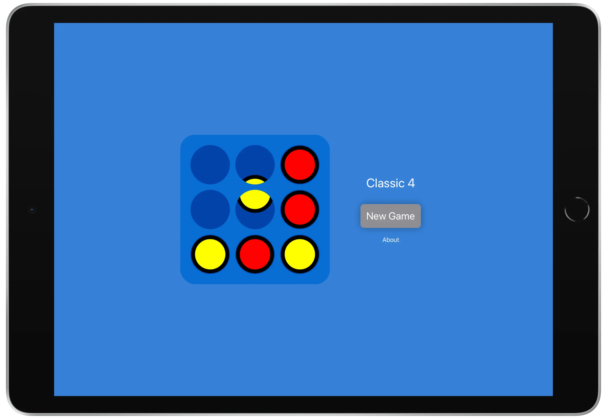
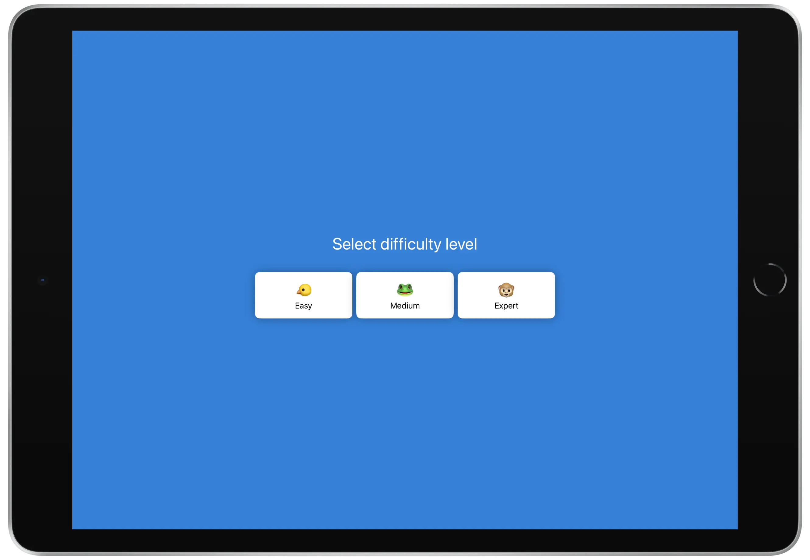
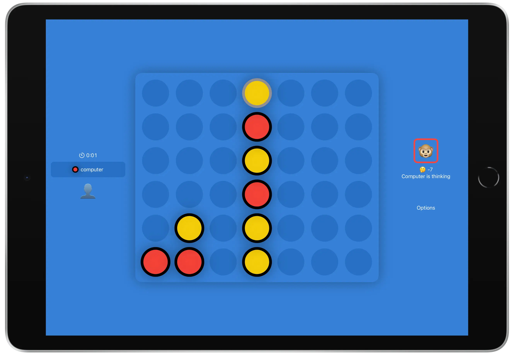

Classic 4 - free iPhone, iPad and Apple TV app. No advertising, no in-app purchases, no tracking.

The goal of the game is very simple: line up 4 checkers vertically, horizontally, or diagonally to win. It's a fun and strategic game, which you can play for free and without advertising!

This game is also known as "Connect 4", or "Four in a row" .

The game engine is written in C++ and based on the [Monte Carlo Tree Search](https://en.wikipedia.org/wiki/Monte_Carlo_tree_search) algorithm.

This app was created by [Julien Eyriès](https://www.jeyries.fr)

Some links:
* [Report an issue](https://github.com/jeyries/classic4/issues)
* [Write me a review](https://apps.apple.com/app/id1524785864?action=write-review)
* [Share this app](https://apps.apple.com/app/id1524785864)
* [My other apps](https://apps.apple.com/developer/id414653864)

Here are some screenshots:

